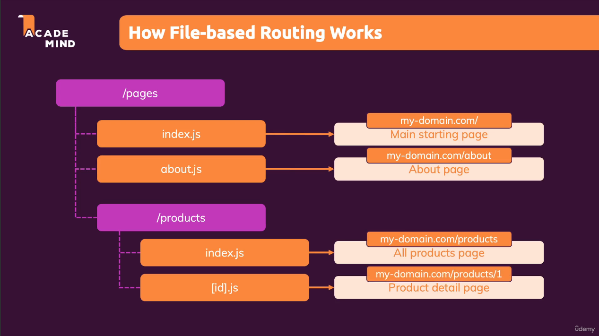
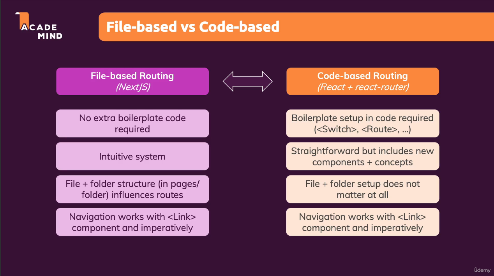
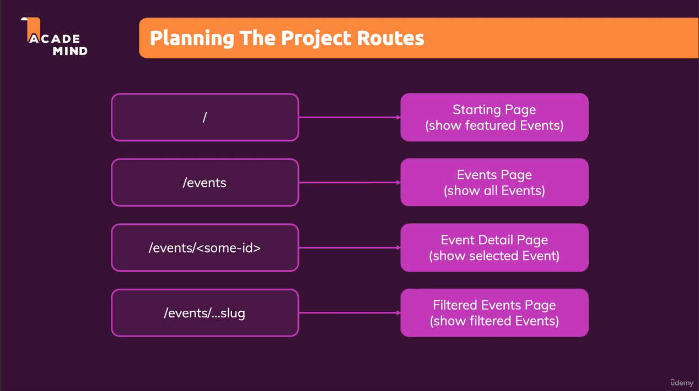
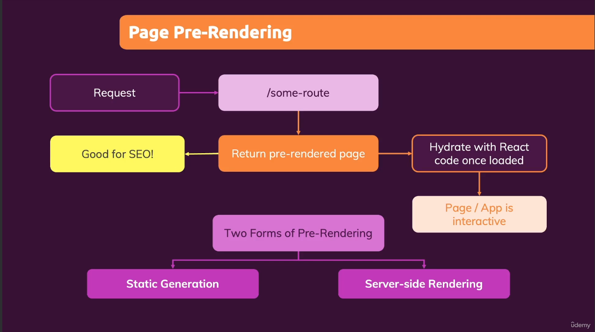
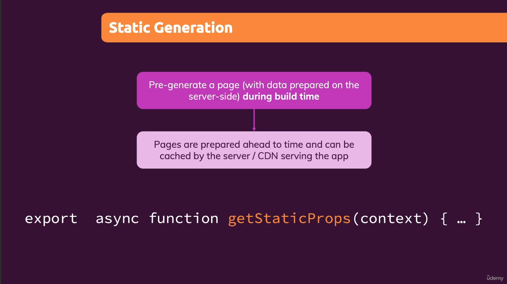
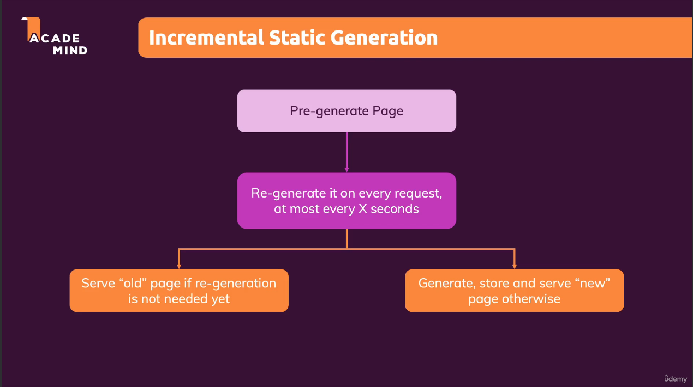
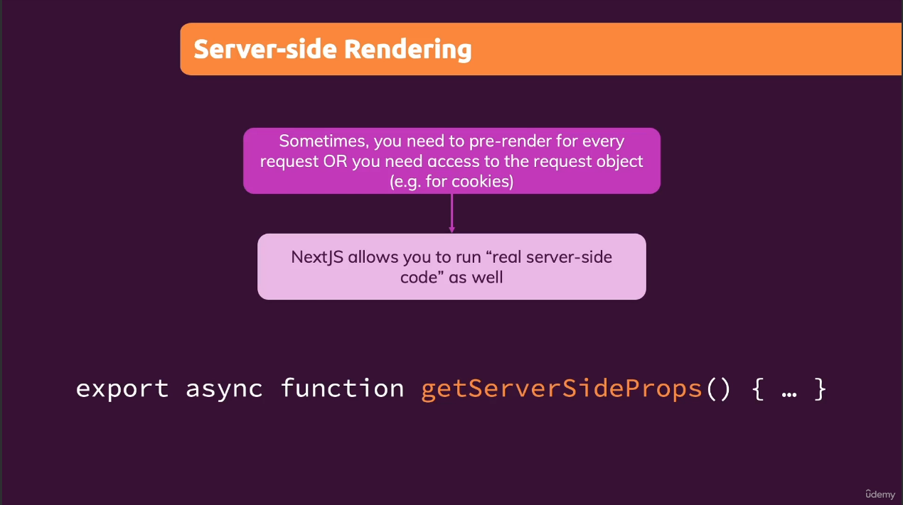
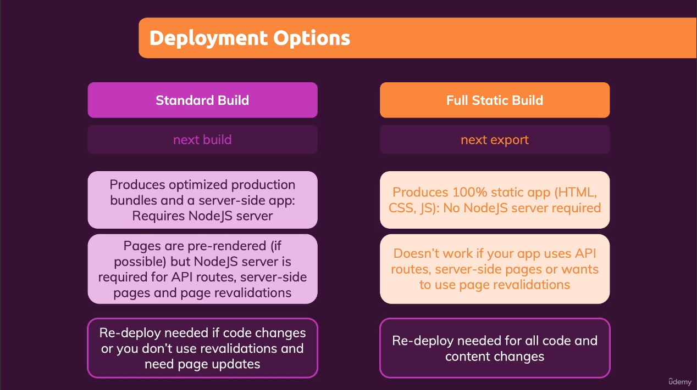

## Section 1: Getting started

### What is Nextjs?
According to [official website](https://nextjs.org/), Nextjs is "The React Framework for the Web". Nextjs defines a clear guidance on how to write code (fetch data, route) and structure files. It also adds many different features like server-side rendering, file-based routing etc

### Key features of Nextjs:
1. Built-in serverside rendering
2. File-based routing
3. Full-stack capabiliies


## Section 3: Pages & file-based routing
File-based routing works by using the file system as a representation for routes instead of configuring a router in a single file using a library (like react-router-dom). When a file is added to the <code>pages</code> directory, it's automatically available as a route.  
If a file: <code>pages/about.js</code> is created that exports a React component, it will be accessible at <code>/about</code>
```JS
export default function About() {
  return <div>About</div>
}
```



File-based vs code-based routing


### Dynamic routes
A dynamic segment can be created by wrapping a folder's name in square brackets.
Example: [id].js or [slug].js
Dynamic segments can be accessed from <code>useRouter</code> hook.

```JS
// pages/clients/[id]/index.js
import { useRouter } from "next/router";

function ClientsProjectPage() {
  const router = useRouter();
  console.log(router.query.id); // Value of 'id' will be 'client1' for route: '/clients/client1'

  return (
      <div>
        <h1>Clients Project Page</h1>
      </div>
  );
}

export default ClientsProjectPage;
```

### Catch-all segments
Dynamic segments can be extended to catch all subsequent segments by adding an ellipsis inside the brackets.  
Example: <code>pages/blog/[...slug].js</code> will catch all routes below:
- /blog/blog1
- /blog/user1/blog1
- /blog/year/month/user1 etc

```JS
// pages/blog/[...slug].js
import { useRouter } from "next/router";

function BlogPostsPage() {
  const router = useRouter();
  console.log(router.query.slug); // // Value of 'slug' will be ['user1', 'post1'] for route: '/shop/user1/post1'
  return (
    <>
      <div>
        <h1>Blog posts page</h1>
      </div>
    </>
  );
}

export default BlogPostsPage;
```

### Optional catch-all segments
Catch-all segments can be made optional by including parameter in double square brackets.  
Example: <code>pages/shop/[[...slug]].js</code>  
The difference between catch-all and optional catch-all segment is that with optional, the route without a parameter (<code>/shop</code>) is also matched.

### Links
Next.js router allows client-side route transitions between pages, similar to a single-page application.  
A React component called <code>Link</code> is provided to do this client-side route transition.
```js
// pages/index.js
import Link from "next/link";

function HomePage() {
    return (
        <>
            <div>
                <h1>Home Page</h1>
            </div>
            <ul>
                <li>
                    <Link href="/profile">Profile</Link>
                </li>
                <li>
                    <Link href="/profile/setting" >Setting</Link>
                </li>
            </ul>
        </>
    );
}

export default HomePage;
```

### Link to dynamic paths

There are two ways to create dynamic paths:
- Method 1: Using interpolation
  To create a path to <code>/clients/[id].js</code>, we can write a template string to create dynamic path to different pages.

- Method 2: Using URL object
  Instead of using interpolation to create the path, we use a URL object in href where:  
  <code>pathname</code> is the name of the page in the pages directory <code>/clients/[id]</code> in this case
  <code>query</code> is an object with the dynamic segment. <code>id</code> in this case;.

```JS
// pages/clients/[id]/index.js
import Link from "next/link";

function ClientsPage() {
  let client = fetch("your-url-here");

  return (
    <>
      <div>
        <h1>Clients Page</h1>
      </div>
      <ul>
        {clients.map((client) => (

          // Method 1
          // <li key={client.id}>
          //   <Link href={`/clients/${encodeURIComponent(client.id)}`}>{client.name}</Link>
          // </li>

          // Method 2
          <li key={client.id}>
            <Link
              href={{
                pathname: "/clients/[id]",
                query: { id: client.id },
              }}
            >
              {client.name}
            </Link>
          </li>
        ))}
      </ul>
    </>
  );
}

export default ClientsPage;
```

### Shallow routing
Shallow routing is a technique to update the URL of a page without reloading the page itself or fetching new data from the server.  

```JS
import { useEffect } from 'react'
import { useRouter } from 'next/router'
 
// Current URL is '/'
function Page() {
  const router = useRouter()
 
  useEffect(() => {
    // Always do navigations after the first render
    router.push('/?counter=10', undefined, { shallow: true })
  }, [])
 
  useEffect(() => {
    // The counter changed!
  }, [router.query.counter])
}
 
export default Page
```
**Note**: Shallow routing only works for URL changes in the current page.  
For example, let's assume we have another page called <code>pages/about.js</code>, and we run the below code:
```JS
router.push('/?counter=10', '/about?counter=10', { shallow: true });
```
Since that's a new page, it'll unload the current page, load the new one and wait for data fetching even though we asked to do shallow routing.

### Custom 404 page
To add a custom 404 page, create a <code>404.js</code> file inside <code>pages</code> directory.

## Section 4: Project time: Working with file-based routing
This section is a small project built to practice File-based routing.

Project routes:


### Add layout to all pages:
To create a layout for all pages, we wrap the component in <code>_app.js</code> with our custom layout. In the example below, we add <code>MainHeader</code>, a component to display navbar in all pages
```JS
// components/layout/layout.js
import MainHeader from "./mainHeader";
import { Fragment } from "react";

function Layout(props) {
  return (
    <Fragment>
      <MainHeader />
      <main>{props.children}</main>
    </Fragment>
  );
}

export default Layout;
```  

```JS
// pages/_app.js
import Layout from "@/components/layout/layout";
import "@/styles/globals.css";

export default function App({ Component, pageProps }) {
  return (
    <Layout>
      <Component {...pageProps} />
    </Layout>
  );
}
```

### Styling components in Next.js:
Next.js has built-in support for css modules. All css module files should end with <code>.module.css</code>

## Section 5: Page Pre-rendering & Data Fetching
Next.js pre-renders every page by default, i.e, it generates HTML for each page in advance, instead of loading it on client side by JavaScript. Pre-rendering helps in better performance and SEO.

Next.js supports two types of pre-rendering:
1. Static generation:  
   Static Generation is the pre-rendering method that generates the HTML at build time. The pre-rendered HTML is then reused on each request.
2. Server-side rendering:  
   Server-side Rendering is the pre-rendering method that generates HTML on each request.

Next.js allows to select type of pre-rendering for each page as required.




### Static Generation
Static generation with data:
To fetch data in static generation, we can use an async function<code>getStaticProps</code>. This function runs at build-time (only once) and inside this function, we can fetch the data and send it as props to the page.

**Important notes on <code>getStaticProps</code> function:**
1. Runs only once at build-time in production and on each request in development mode.
2. Runs on the server-side.
3. Code for this function won't be included in the JS bundle for the browser.
4. Cannot use data only available during request-time like query parameters of HTTP headers.
5. It can only be exported from a page component (components inside <code>page</code> directory).




```JS
import fs from "fs/promises";
import path from "path";

function HomePage(props) {
  const { products } = props;

  return (
    <ul>
      {products.map((product) => (
        <li key={product.id}>{product.title}</li>
      ))}
    </ul>
  );
}

// The code in this function won't be visible in the frontend.
export async function getStaticProps() {
  const filePath = path.join(process.cwd(), "data", "dummyBackend.json");
  console.log(filePath);
  const result = await fs.readFile(filePath);
  const data = JSON.parse(result);

  return {
    props: {
      products: data.products,
    },
  };
}

export default HomePage;
```

### Incremental Static Regeneration (ISR)
In Static Generation, the data fetched for the page was fetched during build time only once and to update the data on the page, re-building and deploying again is inefficient. To update the data on the static page without losing the benefits of Static Generation, we can use Incremental Static Regeneration. It allows to update the static pages after the app/site is built. ISR can be enabled by adding <code>revalidate</code> property to <code>getStaticProps</code> return object.



```JS
export async function getStaticProps() {
  ...
  return {
    props: {
      products: data.products,
    },
    // Update the page after every 60 seconds
    revalidate: 60
  };
}
```

### Static Generation with dynamic routes
Next.js by default pre-renders all pages except dynamic pages. To pre-render dynamic pages, we specify the dynamic paths to pre-render using <code>getStaticPaths</code> function. Next.js will pre-render paths defined in <code>paths</code> key of the returned object.

```JS
export async function getStaticPaths() {
  const data = await getData();

  const productPaths = data.products.map((product) => ({
    params: { pid: product.id },
  }));

  return {
    paths: productPaths,
    fallback: false // false or 'blocking',
  };
}
```

### Server-Side Rendering (SSR)
In Server-side rendering, data for the page is fetched on every request to the page and is useful for data that changes frequently. To use Server-side rendering, we should export <code>getServerSideProps</code> function from the page. This function is called on each request and contains request specific parameters (headers, cookies etc).

 

```JS
function UserProfilePage(props) {
  return <h1>{props.username}</h1>;
}

export default UserProfilePage;

export async function getServerSideProps(context) {
    
  return {
    props: {
      username: "John Doe",
    },
  };
}
```

### Client-Side Rendering (CSR)
In Client-side rendering, data for the page is fetched from the browser and the page will be interactice after the browser has downloaded the application bundle and data for the page. This is how a traditional React app is rendered and is good for dashboards, private sites and cases where SEO is not required.
```JS
import { useEffect, useState } from "react";

function LastSalesPage() {
  const [sales, setSales] = useState();
  const [isLoading, setIsLoading] = useState(false);

  useEffect(() => {
    setIsLoading(true);
    fetch('path to api')
      .then((response) => response.json())
      .then((data) => {
        setSales(data);
        setIsLoading(false);
      });
  }, []);

  if (!data || !sales) {
    return <p>Loading...</p>;
  }

  return (
    <ul>
      {sales.map((sale) => (
        <li key={sale.id}>
          {sale.username} - ${sale.volume}
        </li>
      ))}
    </ul>
  );
}

export default LastSalesPage;
```

### SWR
SWR is a library created by Vercel for data-fetching, revalidating and caching in React applications using hooks. It has many different features such as revalidation on focus, pagination and scroll position recovery etc. 
```JS
import useSWR from 'swr'
 
function Profile() {
  const { data, error, isLoading } = useSWR('/api/user', fetcher)
 
  if (error) return <div>failed to load</div>
  if (isLoading) return <div>loading...</div>
  return <div>hello {data.name}!</div>
}
```

## Section 6: Page pre-rendering and data fetching project
This section is a small project built to practice pre-rendering and data fetching features in Nextjs

### Connection to MongoDB with mongoose
Next.js has an official sample app that describes how to connect to Mongodb with Mongoose. Below is a modified code similar to the official method by Next.js
```JS
import mongoose from "mongoose";

const MONGODB_URI = "mongodb://127.0.0.1:27017/nextjsCourse";

let cached = global.mongoose;

if (!cached) {
  cached = global.mongoose = { conn: null };
}

async function dbConnect() {
  if (cached.conn) {
    return cached.conn;
  }
  console.log("connecting to mongodb");
  cached.conn = await mongoose.connect(MONGODB_URI);

  return cached.conn;
}

export default dbConnect;
```

### Caveats:
1. Error thrown by page <code>pages/events/[eventId].js</code> is caught by <code>[...slug].js</code> page in the same folder. To fix this, we return <code>{ notFound: true }</code> in <code>getStaticProps</code> function inside the page and set <code>fallback</code> option to <code>blocking</code> in <code>getStaticPaths</code> function. This solution may change in future.

## Section 7: Optimizing Nextjs apps

### Head component
<code>Head</code> component is a built-in component in Next.js for appending elements like <code>meta</code>, <code>title</code> to the <code>head</code> element of the page.
```JS
import Head from "next/head.js";

function HomePage(props) {
  ...
  return (
    <>
      <div>
          <Head>
            <title>Events Home Page</title>
            <meta name="description" content="View open events" />
          </Head>
          <EventList items={featuredEvents} />
      </div>
    </>
  );
}
```

* #### Handling conflicts/duplicates in <code>Head</code> component
  To avoid duplicate tags in <code>Head</code> component, <code>key</code> property can be used to make sure only one tag is rendered. In the example below, only the second <code>meta</code> tag will be rendered.

  ```JS
  function HomePage(props) {

  return (
      <>
        <div>
          <Head>
            <title>Events Home Page</title>
            <meta name="description" content="View all events" key="description" />
          </Head>
          <Head>
            <title>Events Home Page</title>
            <meta name="description" content="View open events" key="description" />
          </Head>
        </div>
      </>
    );
  }
  ```

## Custom document
A custom document can update the <code>\<html\></code> and <code>\<body\></code> tags used to render a page. This can be used to add custom <code>head</code>, <code>body</code> tags or set an attribute to an element globally. This custom document is defined in a special <code>_document.js</code> file inside <code>pages</code> directory. In the example below, we add a <code>lang</code> attribute to html tag globally.

```JS
import Document, { Html, Head, Main, NextScript } from 'next/document';

class MyDocument extends Document {
  render() {
    return (
      <Html lang='en'>
        <Head />
        <body>
          <Main />
          <NextScript />
        </body>
      </Html>
    );
  }
}

export default MyDocument;
```

### Image component
The Next.js <code>\<Image\></code> component extends the <code>\</code> element with features for automatic image optimization.  
- Size optimization: Serve correct sized images for different screen sizes.
- Lazy loading: load images only when user enter the viewport.
- Modern image formats: Use WebP and AVIF image formats.
- Visual Stability: Prevent layout shift automatically when images are loading.

```JS
import Image from "next/image";

function Page() {
  ...
  return (
      <Image src={`/${image}`} alt={imageAlt} width={400} height={400} />
      ...
  );
}

export default Page;
```

## Section 8: Backend code with API routes
Any file inside the folder <code>/pages/api</code> is mapped to <code>/api/*</code> and is treated as an API route instead of a page. All endpoints are server-side only and will not be sent to the client. Dynamic API routes and catch-all API routes can be created in the same way as in page routes.  

Example:
```
/api/feedback/index.js        --->    /api/feedback
/api/feedback/[feedback].js   --->    /api/feedback/*
```

### Custom config object:
Every API Route can export a <code>config</code> object to change the default configuration. Check documentation for all config object features.  
Example:
```JS
export const config = {
  api: {
    bodyParser: {
      sizeLimit: '1mb',
    },
  },
  // Specifies the maximum allowed duration for this function to execute (in seconds)
  maxDuration: 5,
}
```


### Note:
1. It is better not to call your own API route inside <code>getStaticProps</code> or <code>getServerSideProps</code> to get data. Instead, export the logic present inside your API route so that it can be used inside <code>getStaticProps</code> or <code>getServerSideProps</code> functions directly. (See lecture 149: Using API Routes for Pre-rendering Pages).

## Section 12: Deploying NextJS apps

### Deployment options in NextJS



To enable static export, change the output mode to <code>export</code> inside <code>next.config.js</code>

```js
// next.config.js
const nextConfig = {
  output: 'export'
}
 
module.exports = nextConfig
```

## Section 13: Authentication in NextJS

### Using next-auth
Next-auth must be configured at file path: <code>/pages/api/auth/[...nextauth].js</code>

```JS
// /pages/api/auth/[...nextauth].js
export default NextAuth({
  session: {
    jwt: true,
  },
  providers: [
    CredentialsProvider({
      async authorize(credentials) {
        // Custom logic to authenticate user.
      },
    }),
  ],
  secret: process.env.NEXTAUTH_SECRET // required in production
});
```


## Course Update for App router

## Section 3: NextJS Essentials (App router)

### Routing in App Router:
Routing in NextJS app router is the same as in file based routing. The difference only being that instead of `index.js`, a `page.js` file is expected.
```
// file-based routing
.
└── src/
    ├── index.js
    └── products/
        ├── index.js
        └── [id].js

// app router
.
└── src/
    ├── page.js
    └── products/
        ├── page.js
        └── [id].js
```

### Client and Server components

- In app router, by default, NextJS uses Server Components. So, any backend code can be written inside the component as long as it does not use any features specific to frontend (usePathname, useEffect, browser APIs etc).  
- To use client component, `use client` directive is used on top of the file above the `import` statements.

### Adding layout in App router

Layout for all routes can be defined in `layout.js` file in root folder. Layout for a specific route can be defined in `layout.js` file in the folder corresponding to that route.
```
.
└── src/
    ├── layout.js // layout for all pages
    └── dashboard/
        ├── page.js
        └── layout.js // layout specific to 'dashboard' page
```

### Loading & error page

- To handle loading state, `loading.js` file can be used inside `src/` folder for all pages or inside a route folder for that specific route.
- Uncaught/unexpected errors can be caught with `error.js` file which must be a _client component_ present in `src/` folder to handle errors for all pages or inside a route folder for a specific route.
- Unexpected errors in _root layout_ can be handled with `global-error.js` file.
- Expected errors in _server actions_ needs to be returned to the client using `useFormState` (renamed to `useActionState` in React 19). Errors in _server components_ can be rendered conditionally based on success/failure of requests.
- Not-found errors: Nextjs has a default 404 page, but can be customized by adding a `not-found.js` file in `src/` directory


```
.
└── src/
    ├── not-found.js
    ├── global-error.js
    ├── error.js
    ├── loading.js
    └── products/
        ├── page.js
        ├── error.js
        └── loading.js
```

### Server actions
Server Actions are __asynchronous functions__ that are executed on the server. They can be called in Server and Client Components to handle form submissions and data mutations in Next.js applications. A Server Action can be defined with the React __use server__ directive. There are two ways to define server actions:

1. Place the directive at the top of an async function to mark the function as a Server Action
    ```ts
    // app/page.tsx

    export default function Page() {
    // Server Action
    async function create() {
      'use server'
      // Mutate data
    }
  
    return '...'
    }
    ```
2. Place the directive at the top of a separate file to mark all exports of that file as Server Actions.
    ```ts
    // app/actions.ts

    'use server'

    export async function create() {}
    ```


### useFormStatus hook
useFormStatus is a Hook that gives you status information of the last form submission. The useFormStatus Hook must be called from a component that is __rendered inside a `<form>`__. The Hook returns information like the pending property which tells you if the form is actively submitting.

```ts
// const { pending, data, method, action } = useFormStatus();

import { useFormStatus } from "react-dom";
import action from './actions';

function Submit() {
  const status = useFormStatus();
  return <button disabled={status.pending}>Submit</button>
}

export default function App() {
  return (
    <form action={action}>
      <Submit />
    </form>
  );
}
```

### useActionState (was _useFormState_ before react 19)
useActionState is a Hook that allows you to update state based on the result of a form action. You pass useActionState an existing form action function as well as an initial state, and it returns a new action that you use in your form, along with the latest form state and whether the Action is still pending. The latest form state is also passed to the function that you provided.

```ts
// const [state, formAction, isPending] = useActionState(fn, initialState, permalink?);

import { useActionState } from "react";

async function increment(previousState, formData) {
  return previousState + 1;
}

function StatefulForm({}) {
  const [state, formAction] = useActionState(increment, 0);
  return (
    <form>
      {state}
      <button formAction={formAction}>Increment</button>
    </form>
  )
}
```

### Metadata
Metadata for the application can be added in two ways in NextJS.
1. Config-based Metadata: export static `metadata` object or dynamic `generateMetadata` function in `layout.js` or `page.js`.
2. File-based metadata: Add static or dynamically generated special files to route segments.

    ```ts
    // layout.js (static metadata)
    export const metadata: Metadata = {
      title: "PriceTail analytics",
      description: "Price tracker for e-commerce websites",
    };


    // /about/page.js
    export async function generateMetadata({params}) {
      // you can perform API calls here

      return {
        title: "About",
        description: "About us - PriceTail Analytics"
      }
    }
    ```

## References
- https://nextjs.org/
- https://nextjs.org/docs/pages/building-your-application/routing
- https://nextjs.org/docs/pages/building-your-application/routing/linking-and-navigating
- https://www.netlify.com/blog/2021/06/02/shallow-routing-in-next.js/
- https://nextjs.org/learn/basics/data-fetching/pre-rendering
- https://nextjs.org/learn/basics/data-fetching/two-forms
- https://nextjs.org/docs/pages/api-reference/functions/get-static-props
- https://nextjs.org/docs/pages/building-your-application/data-fetching/incremental-static-regeneration
- https://nextjs.org/docs/pages/api-reference/functions/get-static-paths
- https://nextjs.org/docs/pages/api-reference/functions/get-server-side-props
- https://swr.vercel.app/
- https://mongoosejs.com/docs/nextjs.html
- https://nextjs.org/docs/pages/api-reference/components/head
- https://nextjs.org/docs/pages/building-your-application/routing/custom-document
- https://nextjs.org/docs/pages/api-reference/components/image
- https://nextjs.org/docs/pages/building-your-application/routing/api-routes
- https://nextjs.org/docs/pages/building-your-application/configuring/environment-variables
- https://nextjs.org/docs/pages/building-your-application/deploying/static-exports
- https://nextjs.org/docs/app/building-your-application/routing/layouts-and-templates
- https://nextjs.org/docs/app/building-your-application/routing/loading-ui-and-streaming
- https://nextjs.org/docs/app/building-your-application/routing/error-handling
- https://nextjs.org/docs/app/building-your-application/data-fetching/server-actions-and-mutations
- https://react.dev/reference/react-dom/hooks/useFormStatus
- https://react.dev/reference/react/useActionState
- https://nextjs.org/docs/app/building-your-application/optimizing/metadata