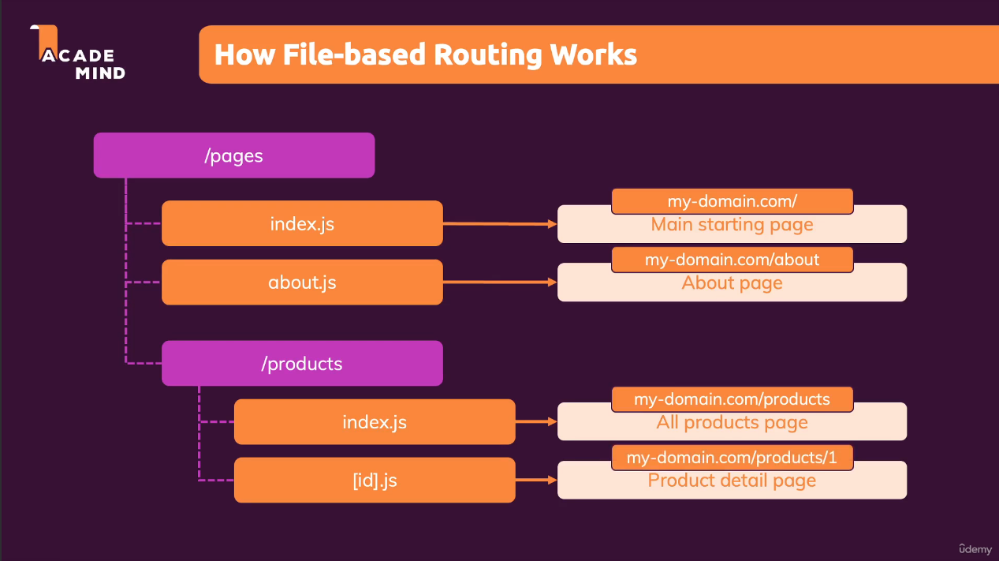

## Section 1: Getting started

### What is Nextjs?
According to [official website](https://nextjs.org/), Nextjs is "The React Framework for the Web". Nextjs defines a clear guidance on how to write code (fetch data, route) and structure files. It also adds many different features like server-side rendering, file-based routing etc

### Key features of Nextjs:
1. Built-in serverside rendering
2. File-based routing
3. Full-stack capabiliies

## Section 2: Pages & file-based routing
File-based routing works by using the file system as a representation for routes instead of configuring a router in a single file using a library (like react-router-dom). When a file is added to the <code>pages</code> directory, it's automatically available as a route.

## References
- https://nextjs.org/
- https://nextjs.org/docs/pages/building-your-application/routing